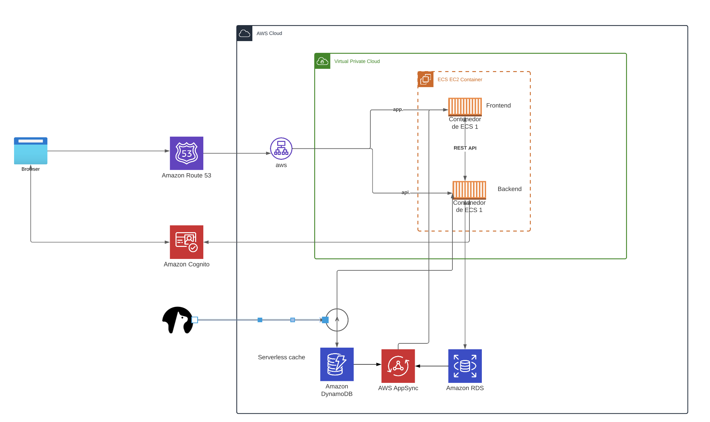

# Week 0 — Billing and Architecture


## Required Implementation

I completed all the task of the week.
- I register in all the required services
- The AWS I already had it when I saw a tutorial from Adreu for a certification, Therefore, all the task related with the new accounts where already done.
- I created the architecture overview in Luci
- I wartched all the videos 
- AWS CLI and proof it works 


# System architecture 

### Requirements
- Application using micro services
- The frontend is in JS and the backend is in Python
- Using api to communicate
- Authentication using Cognito
- Use as much as possible the aws free tier
- Momento as a third party caching system

https://lucid.app/lucidchart/c73396eb-1402-4670-a989-825b4ad1e003/edit?viewport_loc=-1156%2C-52%2C2780%2C1667%2C0_0&invitationId=inv_2bf866ae-a5bd-43f0-86ab-badc62de3787




# AWS CLI

There are 2 types to access aws via CLI.
One is installing the aws CLI from you terminal and after providing the secret key and secret access key and the region where you will call the api.

Another way is to use cloudshell from your the aws console.
Note that not all the regions are available for this functionality. Please check the icon close to the name of your IAM User.

# Billing Alerts
There are 2 ways to set the billing alerts.

- Using Budget.
- Using Cloudwatch Alarm. In this case, you need to create an alarm on us-east-1 region (since it is the only region you can create an alarm). You can create up to 10 free cloudwatch alarm

Note: If you are using an IAM user, make sure to attach a billing policy otherwise you won't be able to access this part of the console and you will get an error as you don't have permission.


### Tags
Tags (are Key/Value pair) are useful when you want to know how your cost is allocated. For example, if your want to identify all the services you used under the tag environment: dev (for example)

### Cost Explorer
Cost explorer is a service which visualises, understands and manages your AWS costs usage over time.

### Report
The section report allows for generating reports. there are some reports already created by AWS that you can use

### Credit
This is the section where you submit the credit that you have to obtain during an event (for example after submitting a feedback questionnaire). And also it shows when the expiration date.

### AWS Calculator
This is a tool where you want to estimate the cost of one or more services. Useful when someone asks you to give an estimated cost of the service you are going to use. I used this tool during some exercises on skillbuilder.


## Budged alarm

- To create the budget alarm with the CLI 

>     --account-id $ACCOUNT_ID \
>     --budget file://aws/json/budget.json \
>     --notifications-with-subscribers file://aws/json/notifications-with-subscribers.json

Note: Important to have the json files necesarries with the configs


## Billing alarm

First we have to create SNS topic

### Create SNS topic

SNS = Amazon Simple Notification services

1. We need an SNS topic before we create an alarm
2. The sSNS topic is what will delivery us an alert when we get overbilled
3. [aws-sns-create]([https://link-url-here.org](https://docs.aws.amazon.com/cli/latest/reference/sns/create-topic.html))


We´ll create a SNS Topic
```
aws sns create-topic --name my-sns-first-topic
```

We´l create a subscription supply the TopicARN and our Email

```
aws sns subscribe \
    --topic-arn TopicARN \
    --protocol email \
    --notification-endpoint prl1694@gmail.com
```

where TopicARN has to be subsitute.

### Create Alarm
⋅⋅* [aws cloudwatch put-metric-alarm] (https://docs.aws.amazon.com/cli/latest/reference/cloudwatch/put-metric-alarm.html)
··* [Create alarm via AWS CLI**]([https://awscli.amazonaws.com/v2/documentation/api/latest/reference/cloudwatch/put-metric-alarm.html](https://aws.amazon.com/premiumsupport/knowledge-center/cloudwatch-estimatedcharges-alarm/))
··* We need to update the configuration json script with the TopicARN we generated earlier
··* We are just a json file becuase --metrics is required for expresisions and so its easier to us a JSON file.

```
aws cloudwatch put-metric-alarm --cli-input-json file://aws/json/alarm-config.json
```


aws sns subscribe \
    --topic-arn="TopicArn": "arn:aws:sns:eu-central-1:528963888625:my-sns-first-topic" \
    --protocol email \
    --notification-endpoint prl1694@gmail.com


--------------------------------------------------------------------------------------------------------------------------------

<details><summary>Implementation instructions</summary>
<br></br>
  

  

## Getting the AWS CLI Working

We'll be using the AWS CLI often in this bootcamp,
so we'll proceed to installing this account.


### Install AWS CLI

- We are going to install the AWS CLI when our Gitpod enviroment lanuches.
- We are are going to set AWS CLI to use partial autoprompt mode to make it easier to debug CLI commands.
- The bash commands we are using are the same as the [AWS CLI Install Instructions]https://docs.aws.amazon.com/cli/latest/userguide/getting-started-install.html


Update our `.gitpod.yml` to include the following task.

```sh
tasks:
  - name: aws-cli
    env:
      AWS_CLI_AUTO_PROMPT: on-partial
    init: |
      cd /workspace
      curl "https://awscli.amazonaws.com/awscli-exe-linux-x86_64.zip" -o "awscliv2.zip"
      unzip awscliv2.zip
      sudo ./aws/install
      cd $THEIA_WORKSPACE_ROOT
```

We'll also run these commands indivually to perform the install manually

### Create a new User and Generate AWS Credentials

- Go to (IAM Users Console](https://us-east-1.console.aws.amazon.com/iamv2/home?region=us-east-1#/users) andrew create a new user
- `Enable console access` for the user
- Create a new `Admin` Group and apply `AdministratorAccess`
- Create the user and go find and click into the user
- Click on `Security Credentials` and `Create Access Key`
- Choose AWS CLI Access
- Download the CSV with the credentials

### Set Env Vars

We will set these credentials for the current bash terminal
```
export AWS_ACCESS_KEY_ID=""
export AWS_SECRET_ACCESS_KEY=""
export AWS_DEFAULT_REGION=us-east-1
```

We'll tell Gitpod to remember these credentials if we relaunch our workspaces
```
gp env AWS_ACCESS_KEY_ID=""
gp env AWS_SECRET_ACCESS_KEY=""
gp env AWS_DEFAULT_REGION=us-east-1
```

### Check that the AWS CLI is working and you are the expected user

```sh
aws sts get-caller-identity
```

You should see something like this:
```json
{
    "UserId": "AIFBZRJIQN2ONP4ET4EK4",
    "Account": "655602346534",
    "Arn": "arn:aws:iam::655602346534:user/andrewcloudcamp"
}
```

## Enable Billing 

We need to turn on Billing Alerts to recieve alerts...


- In your Root Account go to the [Billing Page](https://console.aws.amazon.com/billing/)
- Under `Billing Preferences` Choose `Receive Billing Alerts`
- Save Preferences


## Creating a Billing Alarm

### Create SNS Topic

- We need an SNS topic before we create an alarm.
- The SNS topic is what will delivery us an alert when we get overbilled
- [aws sns create-topic](https://docs.aws.amazon.com/cli/latest/reference/sns/create-topic.html)

We'll create a SNS Topic
```sh
aws sns create-topic --name billing-alarm
```
which will return a TopicARN

We'll create a subscription supply the TopicARN and our Email
```sh
aws sns subscribe \
    --topic-arn TopicARN \
    --protocol email \
    --notification-endpoint your@email.com
```

Check your email and confirm the subscription

#### Create Alarm

- [aws cloudwatch put-metric-alarm](https://docs.aws.amazon.com/cli/latest/reference/cloudwatch/put-metric-alarm.html)
- [Create an Alarm via AWS CLI](https://aws.amazon.com/premiumsupport/knowledge-center/cloudwatch-estimatedcharges-alarm/)
- We need to update the configuration json script with the TopicARN we generated earlier
- We are just a json file because --metrics is is required for expressions and so its easier to us a JSON file.

```sh
aws cloudwatch put-metric-alarm --cli-input-json file://aws/json/alarm_config.json
```

## Create an AWS Budget

[aws budgets create-budget](https://docs.aws.amazon.com/cli/latest/reference/budgets/create-budget.html)

Get your AWS Account ID
```sh
aws sts get-caller-identity --query Account --output text
```

- Supply your AWS Account ID
- Update the json files
- This is another case with AWS CLI its just much easier to json files due to lots of nested json

```sh
aws budgets create-budget \
    --account-id AccountID \
    --budget file://aws/json/budget.json \
    --notifications-with-subscribers file://aws/json/budget-notifications-with-subscribers.json
```

  
  
</details>
  
  --------------------------------------------------------------------------------------------------------------------------------

