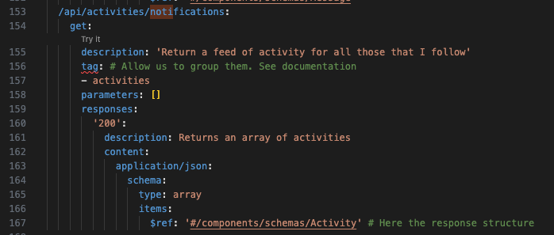
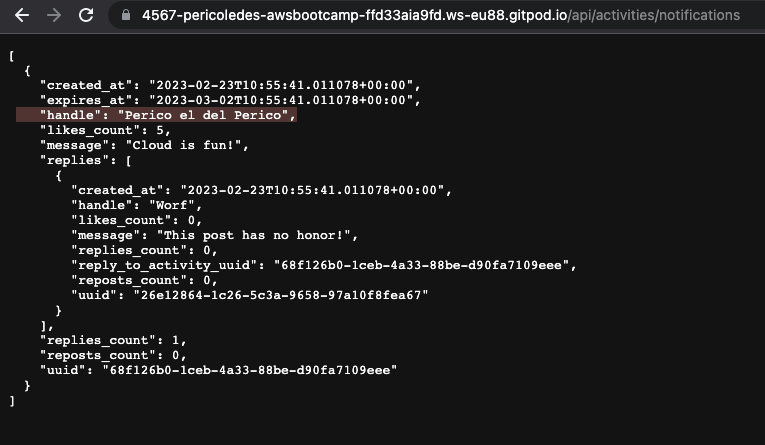
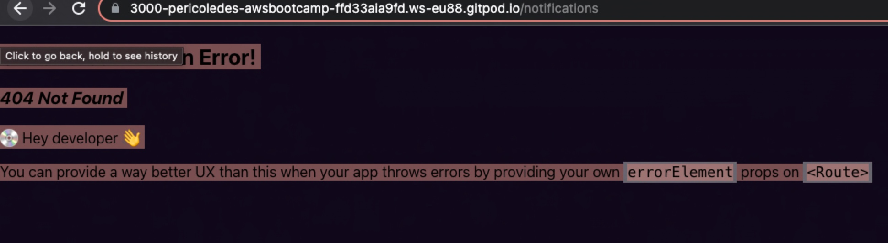
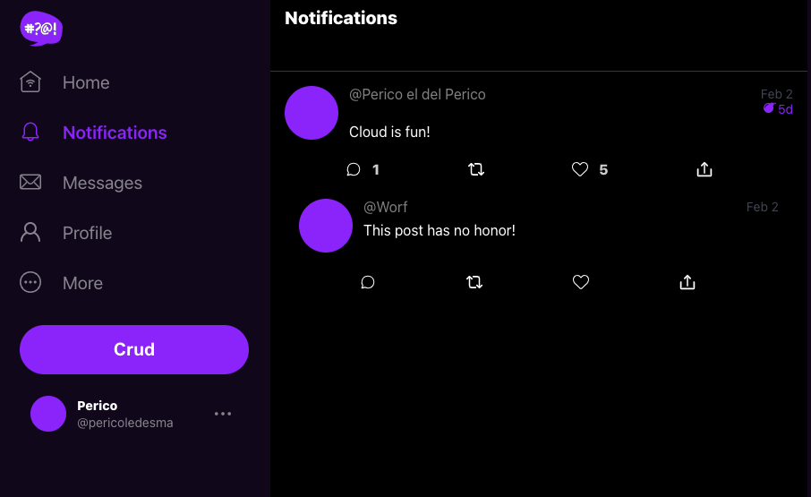

# Week 1 — App Containerization

### Content

1. [Objetives](#Objetives)
2. [Week summary](#Week-summary)
3. [AWS Services used](#AWS-Services-used)
4. [Week content](#Week-content)
5. [Implementation notes](#2-Implementation-notes)
6. [Useful references](#Useful-references )
7. [Implementation instructions](https://github.com/PericoLedesma/aws-bootcamp-cruddur-2023/blob/main/journal/week_instructions/week1.md)

# Objetives
- Gain practical knowledge working with common docker command and running container images for the purpose of local development
- Gain practical knowledge of working within a Cloud Development environment
- Be able to navigate a backend and front web-application and generally understand how they work 

# Week summary 

- Create a new GitHub repo
- Launch the repo within a Gitpod workspace
- Configure Gitpod.yml configuration, eg. VSCode Extensions
- Clone the frontend and backend repo
- Explore the codebases
- Ensure we can get the apps running locally
- Write a Dockerfile for each app
- Ensure we get the apps running via individual container
- Create a docker-compose file
- Ensure we can orchestrate multiple containers to run side by side
- Mount directories so we can make changes while we code

# AWS Services used

None

# Week content

[Back index](#content)

### Security on Container

Container security is the practice of protecting your applications hosted on compute services like containers. 

Why use containers?

> It is a angnostic way to run application. Most people started developing apps on container due to the simplicity to pass the package without considering requirements.
 
[What is a container](https://docs.docker.com/get-started/)
[Docker compose get start](https://docs.docker.com/compose/gettingstarted/)

Managed vs unmanaged containers

> - Managed Containers means that the Provider like AWS managed the underlying service for the container (ECS or EKS). In this case Cloud provider will be managing the security prospective .

> - Unmanaged Containers means you are running your container on your servers and you have to manage all the system (for example you will be in charged to apply security patches).


Why containers security requires practice?

> Complexity with containers
> Relying on CSPs for features
> UnManaged requires a lot more hours of work than managed but would require you keeping updated on everthing

Containers security components
> Docker and host configurations
> Securing images
> Secret management
> Application security
> Data Security
> Monitoring Containers
> Compliance Framework

Security best practices
> - Keep Host & Docker Updated to latest security patches.
> - Docker Deamon & containers should run in non root user mode
> - Image Vulnerability Scanning
> - Trust a Private vs Public Image Registry
> - No Sensitive Data in Docker Files or Images
> - Use Secret Management Services to share secrets.
> - Read only file system and volume for dockers
> - Separate databases for long term storage
> - Use DevSecOps pratices while building application security
> - Ensure all code is tested for vulnerabilities before production use

Tools to identify vulnerailitues on your containers are:
> - Snyk OpenSource Security. 
> - AWS Inspector

Tools to store and manage secrets are:
> - AWS Secret Manager 
> - Harshicorp Vault

For Managed Containers in AWS:
> - AWS ECS
> - AWS EKS
> - AWS Fargate

Reason to run containers on the cloud
> - Integration with AWS Services
> - Using automation to provision containers at sale with speed and security

 
Docker compose
> It is a tool for defining and running multi container Docker Applications (It uses yml file).

### Dockers components


 

# Implementation notes
[Back index](#content)

### Coding Flask Backend endpoint for notifications

Curretly, the notifications endpoint API was not created.

First, we created the endpoint in the OpenAPI file first with the same structure as homeAPI



We linked with the NotificationActivities class that we created to the openAPI route.

We can see after we linked to the class the route the hardcore results are given by the API.




### Coding the React page for notifications

Currently, the Notifications page was not created.



We created the page in app.js and create the NotificationsFeedPage.js with same structure as home page




## Adding DynamoDB Local and Postgres

We are going to use Postgres and DynamoDB local in future labs
We can bring them in as containers and reference them externally

Lets integrate the following into our existing docker compose file:

### Postgres

What is Postgres?
> Is a free and open-source relational database management system emphasizing extensibility and SQL compliance.

[Setting up Postgres local](https://www.prisma.io/dataguide/postgresql/setting-up-a-local-postgresql-database)

We add this to the docker-compose.yml file:

```yaml
services:
  db:
    image: postgres:13-alpine
    restart: always
    environment:
      - POSTGRES_USER=postgres
      - POSTGRES_PASSWORD=password
    ports:
      - '5432:5432'
    volumes: 
      - db:/var/lib/postgresql/data

```
And this part in the end of the file after networks:

```
volumes:
  db:
    driver: local
```

To install the postgres client into Gitpod(add to gitpod.yml file in tasks)

```sh
  - name: postgres
    init: |
      curl -fsSL https://www.postgresql.org/media/keys/ACCC4CF8.asc|sudo gpg --dearmor -o /etc/apt/trusted.gpg.d/postgresql.gpg
      echo "deb http://apt.postgresql.org/pub/repos/apt/ `lsb_release -cs`-pgdg main" |sudo tee  /etc/apt/sources.list.d/pgdg.list
      sudo apt update
      sudo apt install -y postgresql-client-13 libpq-dev
```

To access to the postgres DB:
```
psql -Upostgres --host localhost

```

### DynamoDB Local

What is DynamoDB?
> Is a fully managed proprietary NoSQL database service that supports key–value and document data structures and is offered by Amazon.com as part of the Amazon Web Services portfolio. 

With the downloadable version of Amazon DynamoDB, you can develop and test applications without accessing the DynamoDB web service. Instead, the database is self-contained on your computer. When you're ready to deploy your application in production, you remove the local endpoint in the code, and then it points to the DynamoDB web service.

Having this local version helps you save on throughput, data storage, and data transfer fees. In addition, you don't need an internet connection while you develop your application.

[Setting up DynamoDB local](https://docs.aws.amazon.com/amazondynamodb/latest/developerguide/DynamoDBLocal.html)

[Example using DynamoDB Local: Challenge DynamoDB local](https://github.com/100DaysOfCloud/challenge-dynamodb-local)

We add this to the docker-compose.yml file:

```yaml
services:
  dynamodb-local:
    # https://stackoverflow.com/questions/67533058/persist-local-dynamodb-data-in-volumes-lack-permission-unable-to-open-databa
    # We needed to add user:root to get this working.
    user: root
    command: "-jar DynamoDBLocal.jar -sharedDb -dbPath ./data"
    image: "amazon/dynamodb-local:latest"
    container_name: dynamodb-local
    ports:
      - "8000:8000"
    volumes:
      - "./docker/dynamodb:/home/dynamodblocal/data"
    working_dir: /home/dynamodblocal
```


## Volumes

directory volume mapping

```yaml
volumes: 
- "./docker/dynamodb:/home/dynamodblocal/data"
```

named volume mapping

```yaml
volumes: 
  - db:/var/lib/postgresql/data

volumes:
  db:
    driver: local
```
 
 
# Useful references 
[Back index](#content)

[What is a container](https://docs.docker.com/get-started/)
 
[Docker compose get start](https://docs.docker.com/compose/gettingstarted/)
 
[Rails Service Objects]( https://www.toptal.com/ruby-on-rails/rails-service-objects-tutorial)
 
[OpenAPI documentation](https://spec.openapis.org/oas/v3.1.0#responses-object)

[ReadMe transforms your API docs into interactive hubs that help developers succeed](https://readme.com)

[What is Clair?](https://www.redhat.com/en/topics/containers/what-is-clair)
 
[linuxserver.io: Building and maintaining community images ](https://www.linuxserver.io/)
 


