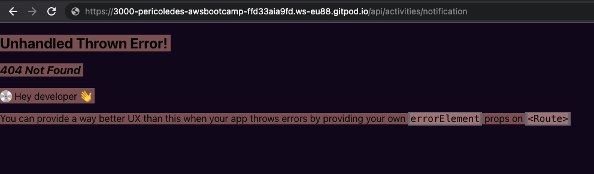

# Week 1 — App Containerization

## Class content

## Practice

### Coding the startpoint for the notifications endpoint API

Curretly, the notifications endpoint API was not created:

### Coding the startpoint for the notifications frontend Page

