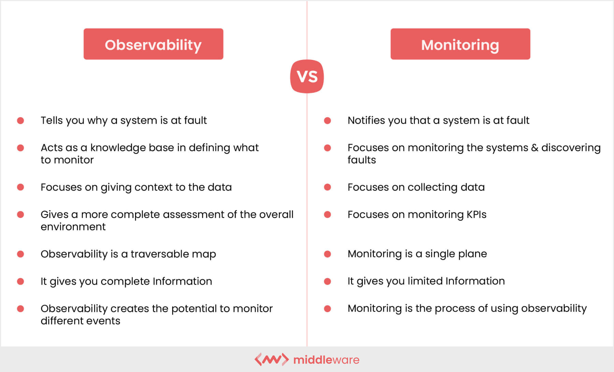
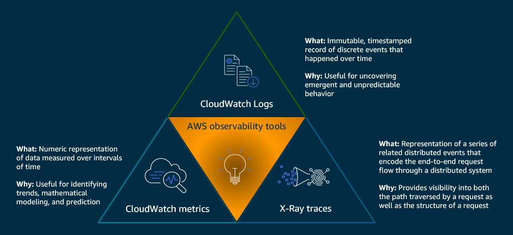
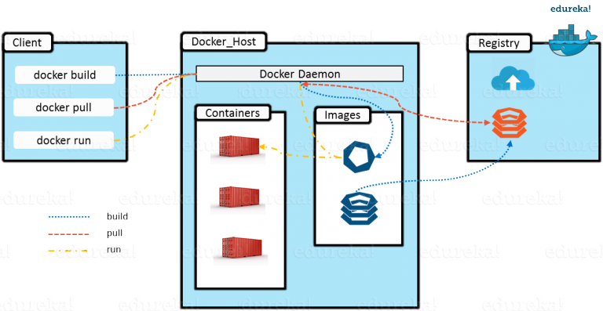
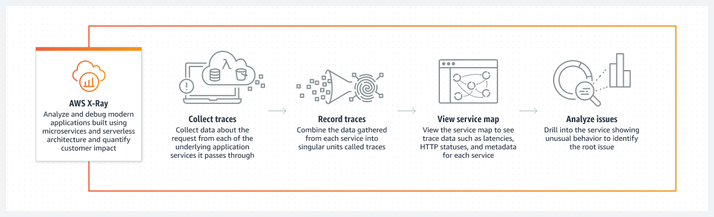
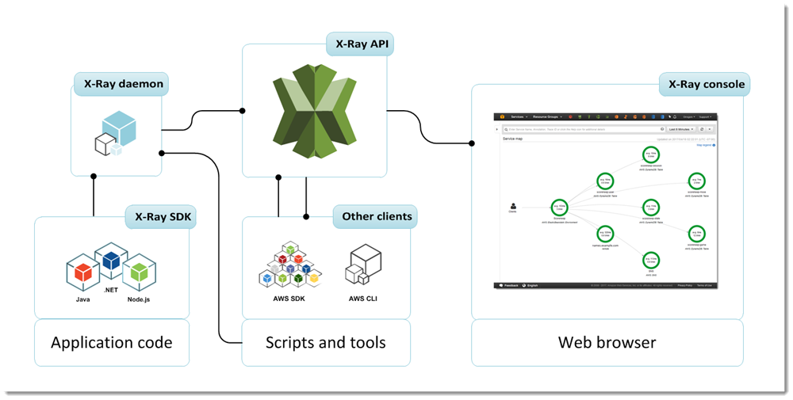
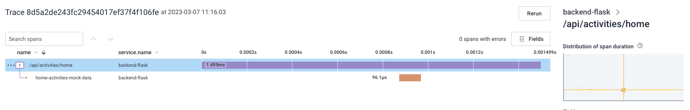
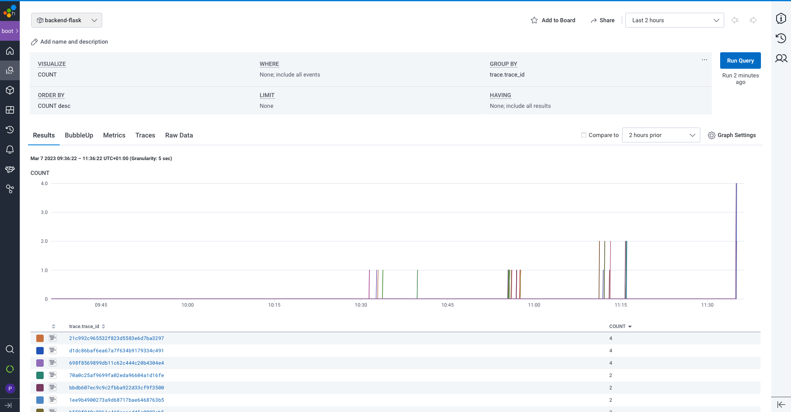
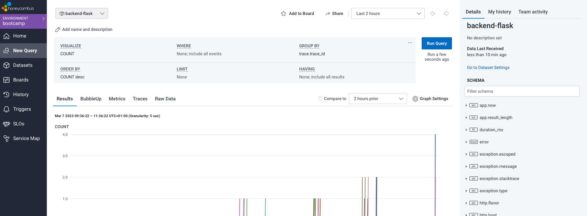
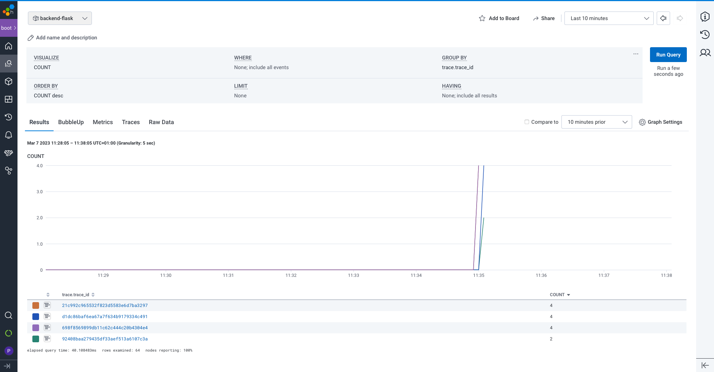

# Week 2 — Distributed Tracing

__Objetive:__ Distributed tracing implementation to add the functionality to easy pinpoint issue when adding cloud services.

        Note: week 2 was done with week 3 due to master exams.

(click to open section)

Week content

   

### What is observability?
>Observability is the extent to which the internal states of a system can be inferred from externally available data. An observable software system provides the ability to understand any issue that arises. Conventionally, __the three pillars of observability data are metrics, logs and traces.__

### What are traces?

>A trace represents the entire journey of a request or action as it moves through all the nodes of a distributed system.

### What are logs?

>A log file is a computer-generated data file that contains information about usage patterns, activities, and operations within an operating system, application, server or another device. Log files show whether resources are performing properly and optimally.\
>On-Premise logs: infraestructure , applications, anti-virus, Firewall..
>Cloud Logs: infraestructure** , applications**, anti-virus, Firewall..

### Observability vs Monotoring
        
Problem of logging
- Time-consuming
- Tons of data with no context for why of the security events
- Needles in a haystack to find things
- Increase alert fatigue for SOC team and application team

Why Observability?
- Decreased alert fatigue
- Visibility of end2end of logs, metrics and tracing
- troubleshoot and resolve things quickly
- Understand application health
- Accelerate team collaboration
- Reduce overall operational cost
- Increase customer satisfaction

### What is Observability in AWS?

>Open-source solutions, giving you the ability to understand what is happening across your technology stack at any time. AWS observability lets you collect, correlate, aggregate, and analyze telemetry in your network, infrastructure, and applications in the cloud, hybrid, or on-premises environments so you can gain insights into the behavior, performance, and health of your system. 
>These insights help you detect, investigate, and remediate problems faster; and coupled with artificial intelligence and machine learning, proactively react, predict, and prevent problems.
        
Obeservability services in AWS
- AWS Cloudwatch logs
- AWS Cloudwatch metrics
- AWS X Ray traces

***Instrumentation*** is what helps you to create or produce logs metrics traces.

[AWS Observability](https://aws.amazon.com/cloudops/monitoring-and-observability/?whats-new-cards.sort-by=item.additionalFields.postDateTime&whats-new-cards.sort-order=desc&blog-posts-cards.sort-by=item.additionalFields.createdDate&blog-posts-cards.sort-order=desc)

### For what are we using Honeycomb? To visualice and read the data extracted.

>Is a software debugging tool that can help you solve problems faster within your distributed services. Honeycomb provides full stack observability—designed for high cardinality data and collaborative problem solving, enabling engineers to deeply understand and debug production software together.

[HoneyComb](https://www.honeycomb.io)

### How are we sending the traces, metrics and logs to HoneyComb? OpenTelemetry

> Honeycomb supports OpenTelemetry, the CNCF open standard for sending traces, metrics, and logs. If your application is already instrumented for OpenTelemetry, you can send OTLP data directly to Honeycomb’s endpoint.

[OpenTelemetry](https://docs.honeycomb.io/getting-data-in/opentelemetry-overview/)

What is middleware for web applications?
        
> Middleware is software that different applications use to communicate with each other. It provides functionality to connect applications intelligently and efficiently so that you can innovate faster. Middleware acts as a bridge between diverse technologies, tools, and databases so that you can integrate them seamlessly into a single system. The single system then provides a unified service to its users. For example, a Windows frontend application sends and receives data from a Linux backend server, but the application users are unaware of the difference.
 
        
What is a Daemon?

>A daemon is a process that runs in the background rather than under the direct control of the user. Although you run docker commands on your host machine, these commands do none of the processing on your Docker containers and images. They are frequently also servers that accept requests from clients to perform actions for them.

### What is AWS X-RAY?
>AWS X-Ray provides a complete view of requests as they travel through your application and filters visual data across payloads, functions, traces, services, APIs, and more with no-code and low-code motions.

[AWS X-RAY](https://aws.amazon.com/xray/?nc1=h_ls)

[Configuring the AWS X-Ray daemon](https://docs.aws.amazon.com/xray/latest/devguide/xray-daemon-configuration.html)

[What are the best practises for setting up x-ray daemon?](https://stackoverflow.com/questions/54236375/what-are-the-best-practises-for-setting-up-x-ray-daemon)

[AWS X-RAY:SDK python](https://docs.aws.amazon.com/xray/latest/devguide/xray-sdk-python.html)

[AWS X-RAY:SDK python](https://github.com/aws/aws-xray-sdk-python)

--------------------------------

        
        
        

Practice

1. Instrument our backend flask application to use Open Telemetry (OTEL) with Honeycomb.io as the provider
   * Set up the endpoint in the honeycomb.ai API
   * Service name is the name of the span
   * Each endpoint as a service object. Each endpoint is modular and points to a service in the back in our application.
   * To create spans we need tracers that will send the data to the API
   * [To include tracers in other parts](https://devpress.csdn.net/python/62f4e4c27e66823466189204.html)
        
2. Run queries to explore traces within Honeycomb.io
   * Right panel we can search for our tracers
        

        

        

        

              
3. Instrument AWS X-Ray into backend flask application
   * [We create groups of X-RAYS traces: to group traces together](https://eu-central-1.console.aws.amazon.com/cloudwatch/home?region=eu-central-1#xray:settings/groups)
   * [We create a sampling rule to control how much information we see.](https://eu-central-1.console.aws.amazon.com/cloudwatch/home?region=eu-central-1#xray:settings/sampling-rules)

4. Configure and provision X-Ray daemon within docker-compose and send data back to X-Ray API

   * We need a docker daemon to make it work. 
 
   * [X-RAY-SED-Python]([assets/week2_trace.png](https://docs.aws.amazon.com/xray/latest/devguide/xray-sdk-python.html))
         
   * [X-RAY-SED-Python Github Repository]([assets/week2_trace.png](https://github.com/aws/aws-xray-sdk-python))        
        
   * How to install daemon [Documentation](https://docs.aws.amazon.com/xray/latest/devguide/xray-daemon.html)
        
5. Observe X-Ray traces within the AWS Console
   * [X-RAY subsegments](https://olley.hashnode.dev/aws-free-cloud-bootcamp-instrumenting-aws-x-ray-subsegments)

6. Integrate Rollbar for Error Logging
   * [Reports](https://rollbar.com/rgzledesma/all/items/?sort=%5Bobject%20Object%5D&status=active&date_from=&date_to=&environments=production&activated_to=&framework=&levels=10&levels=20&levels=30&levels=40&levels=50&activated_from=&offset=0&timezone=Europe%2FBerlin&assigned_user=&date_filtering=seen&projects=624482&query=&enc_query=)
        
7. Trigger an error an observe an error with Rollbar
        
8. Install WatchTower and write a custom logger to send application log data to CloudWatch Log group
   * Watchtower: library in python to habdle cloudwatch logs. [Documentation](https://pypi.org/project/watchtower/)
   * Carefull cloudwatch cost money. Same xray. Not much. We disable it.

Troubles during implementation.     
>I had issures becuase the was a step that I miss or was not explained and I lost some days strying to fix it. We have to go to the frontend repository and install npm. Because I did not run this step i was stak for a while. I thought the npm was installed with the docker file

------------------------------------------------------------------

Challenges

- [ ] Adding Attributes to Spans 
- [ ] Instrument Honeycomb for the frontend-application to observe network latency between frontend and backend[HARD]
- [ ] Add custom instrumentation to Honeycomb to add more attributes eg. UserId, Add a custom span What would we usefull for us
- [ ] Run custom queries in Honeycomb and save them later eg. Latency by UserID, Recent Traces
- [ ] Add aditional information rollbar
       

------------------------------------------------------------------

Pricing aspects

   
        
* 100 million monthly events are included in the Honeycomb free tier       
* The Rollbar free tier includes up to 5,000 events per month, which can include error events, logged errors, and custom events.
* On the AWS X-Ray free tier, you can trace up to 100,000 requests per month at no charge.
* Cloudwatch (always free tier):
        - 10 custom metrics and alarm
        - 1.000.000 API request
        - 5GB of log dataingestion and 5 GB of log Data Archive
        - 3 Dashboards with up to 50 Metrics each per month
  
        
        

