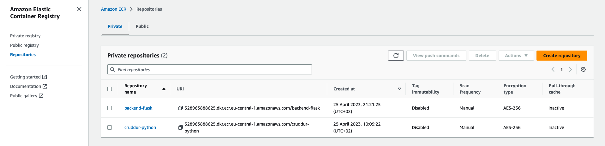
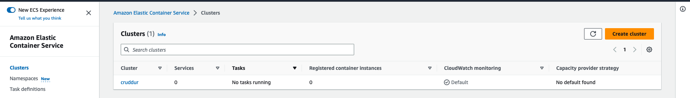

# Week 6 — Deploying Containers

### Content

1. [Objetives](#Objetives)
2. [Week summary](#Week-summary)
3. [AWS Services used](#AWS-Services-used)
4. [Week content](#Week-content)
5. [Implementation notes](#Implementation-notes)
    - ECS Cluster and ECR Repo
    - Images of Backend and Frontend
    - AWS Roles and Security Groups
    - Application Load Balancer
    - Domain Configuration
    - Fargate Services and Tasks
7. [Implementation instructions](https://github.com/PericoLedesma/aws-bootcamp-cruddur-2023/blob/main/journal/week_instructions/week6.md)

----------------------------------------------------------------

### Objetives
- Being able to push and tag container images to remote repository 
- Practical knowledge of deploying, configuring and updating a serverless container
- Basic knowledge of working with a cloud CLI

### Week Summary

- Create an Elastic Container Repository (ECR) 
- Push our container images to ECR
- Write an ECS Task Definition file for Fargate
- Launch our Fargate services via CLI
- Test that our services individually work
- Play around with Fargate desired capacity
- How to push new updates to your code update Fargate running tasks
- Test that we have a Cross-origin Resource Sharing (CORS) issue

### AWS Services used

# Week content
[(Back to index)](#content)


### [Elastic Container Repository (ECR)](https://aws.amazon.com/ecr/)

- Amazon Elastic Container Registry (ECR) is a fully-managed container registry service provided by Amazon Web Services (AWS). It allows developers to store, manage, and deploy Docker container images in a highly available and secure manner.

[Pushing a Docker image](https://docs.aws.amazon.com/AmazonECR/latest/userguide/docker-push-ecr-image.html)



### [Amazon Elastic Container Service (ECS)](https://aws.amazon.com/ecs/) 

- Amazon Elastic Container Service (ECS) is a fully-managed container orchestration service provided by Amazon Web Services (AWS). ECS enables developers to easily deploy, manage, and scale containerized applications using Docker containers and Kubernetes.

With ECS, developers can define and run containerized applications on a cluster of EC2 instances or using AWS Fargate, a serverless compute engine for containers.

A __cluster__ is a logical grouping of EC2 instances or AWS Fargate tasks that are used to run and manage containerized applications. A cluster is essentially a pool of resources that can be used to run containers.

When you create a cluster in ECS, you specify the type and size of EC2 instances or Fargate tasks that you want to use to run your containers. You can also configure auto scaling policies to automatically add or remove instances or tasks based on the resource utilization of your containers.

A task definition is a blueprint that defines how a Docker container should be launched and run within an ECS cluster. It specifies important details about the container, such as which Docker image to use, how much CPU and memory to allocate, which ports to expose, and what environment variables to set.





We used the [json file](https://github.com/PericoLedesma/aws-bootcamp-cruddur-2023/blob/main/aws/task-definitions/backend-flask.json) to created and define the backend-flask task. 


### [Amazon EC2](https://aws.amazon.com/ec2/)

- Is a web service provided by Amazon Web Services (AWS) that allows users to rent virtual servers, also known as instances, on which they can run their own applications. EC2 instances can be customized to meet specific computing requirements, including CPU, memory, storage, and networking capacity.


### [Elastic Load Balancing](https://aws.amazon.com/elasticloadbalancing/)

Elastic Load Balancing (ELB) automatically distributes incoming application traffic across multiple targets and virtual appliances in one or more Availability Zones (AZs).


-------------------------------

# Implementation notes
[(Back to index)](#content)

We need to:
1. Create ECS cluster
2. Create ECR repository where we are going to store the docker images of the frontend and backend. We need to login in AWS ECR to complete this step.
3. Create the images in gitpod and tag them 
4. Push the images. We have to setup the ECR repository URL
5. Create Task and Exection Roles for Task Defintion
6. Create Security Group
7. Application load balancer
8. Create the task definitions in AWS. We have json file for creating and config
9. Create the services in AWS. We have json file for creating and config


## ECS Cluster and ECR Repo

Using AWS CLI, we created:
- a CloudWatch log group named `cruddur`
- a ECS cluster named `cruddur`
- three ECR repos on AWS: cruddur-python, backend-flask and frontend-react-js
 

Export and remember some AWS env vars in the gitpod workspace: 
- AWS_ACCOUNT_ID
- ECR_PYTHON_URL
- ECR_FRONTEND_REACT_URL
- ECR_BACKEND_FLASK_URL


## Images of Backend and Frontend

Pull a base image of python, backend and frontend, then tag and push it to our ECR repo:

```sh
./bin/ecr/login #To log in ecr

docker pull python:3.10-slim-buster
docker tag python:3.10-slim-buster $ECR_PYTHON_URL:3.10-slim-buster
docker push $ECR_PYTHON_URL:3.10-slim-buster
```

For the backend image, created `backend-flask/bin/health-check`, and updated `backend-flask/app.py` to add route for health check. We updated backend dockerfile for development and production. Flask is secured by not running in debug mode. Now we can build backend image and push it to ECR:

```sh
./bin/backend/build
./bin/ecr/login
./bin/backend/push
```

For the frontend image, we created `frontend-react-js/Dockerfile.prod` and `frontend-react-js/nginx.conf`. Now we can build frontend image and push it to ECR:

```sh
cd frontend-react-js
npm run build
cd ../
./bin/frontend/build
./bin/ecr/login
./bin/frontend/push
```

Before pushing images to ECR, we can docker compose up to see if they work locally with data from/to local postgres and local dynamo db:

```sh
docker create cruddur-net
docker compose up
./bin/db/setup
./bin/ddb/schema-load
./bin/ddb/seed
```

Or only check the backend locally by:

```sh
docker create cruddur-net
docker compose up dynamodb-local db xray-daemon
./bin/db/setup
./bin/backend/run
```

## AWS Roles and Security Groups

We added AWS policies for `CruddurServiceExecutionRole` and `CruddurServiceExecutionPolicy`.


Then create the TaskRole `CruddurTaskRole` and attach policies:

```sh
aws iam create-role \
    --role-name CruddurTaskRole \
    --assume-role-policy-document "{
  \"Version\":\"2012-10-17\",
  \"Statement\":[{
    \"Action\":[\"sts:AssumeRole\"],
    \"Effect\":\"Allow\",
    \"Principal\":{
      \"Service\":[\"ecs-tasks.amazonaws.com\"]
    }
  }]
}"

aws iam put-role-policy \
  --policy-name SSMAccessPolicy \
  --role-name CruddurTaskRole \
  --policy-document "{
  \"Version\":\"2012-10-17\",
  \"Statement\":[{
    \"Action\":[
      \"ssmmessages:CreateControlChannel\",
      \"ssmmessages:CreateDataChannel\",
      \"ssmmessages:OpenControlChannel\",
      \"ssmmessages:OpenDataChannel\"
    ],
    \"Effect\":\"Allow\",
    \"Resource\":\"*\"
  }]
}"

aws iam attach-role-policy \
  --policy-arn arn:aws:iam::aws:policy/CloudWatchFullAccess \
  --role-name CruddurTaskRole

aws iam attach-role-policy \
  --policy-arn arn:aws:iam::aws:policy/AWSXRayDaemonWriteAccess \
  --role-name CruddurTaskRole
```

Get `DEFAULT_VPC_ID` and `DEFAULT_SUBNET_IDS` in order to create a security group named `crud-srv-sg` that has inbound rules for port 4567 and 3000, and then authorize the security group to gain access of RDS (port 5432 in the default security group):

```sh
export DEFAULT_VPC_ID=$(aws ec2 describe-vpcs \
--filters "Name=isDefault, Values=true" \
--query "Vpcs[0].VpcId" \
--output text)
echo $DEFAULT_VPC_ID

export DEFAULT_SUBNET_IDS=$(aws ec2 describe-subnets  \
 --filters Name=vpc-id,Values=$DEFAULT_VPC_ID \
 --query 'Subnets[*].SubnetId' \
 --output json | jq -r 'join(",")')
echo $DEFAULT_SUBNET_IDS

export CRUD_SERVICE_SG=$(aws ec2 create-security-group \
  --group-name "crud-srv-sg" \
  --description "Security group for Cruddur services on ECS" \
  --vpc-id $DEFAULT_VPC_ID \
  --query "GroupId" --output text)
echo $CRUD_SERVICE_SG

aws ec2 authorize-security-group-ingress \
  --group-id $CRUD_SERVICE_SG \
  --protocol tcp \
  --port 4567 \
  --cidr 0.0.0.0/0

aws ec2 authorize-security-group-ingress \
  --group-id $CRUD_SERVICE_SG \
  --protocol tcp \
  --port 3000 \
  --cidr 0.0.0.0/0

aws ec2 authorize-security-group-ingress \
  --group-id $DB_SG_ID \
  --protocol tcp \
  --port 5432 \
  --source-group $CRUD_SERVICE_SG
```

We pass some sensitive data to AWS to task definition that we are going to need for running backend-flask later:

```sh
aws ssm put-parameter --type "SecureString" --name "/cruddur/backend-flask/AWS_ACCESS_KEY_ID" --value $AWS_ACCESS_KEY_ID
aws ssm put-parameter --type "SecureString" --name "/cruddur/backend-flask/AWS_SECRET_ACCESS_KEY" --value $AWS_SECRET_ACCESS_KEY
aws ssm put-parameter --type "SecureString" --name "/cruddur/backend-flask/CONNECTION_URL" --value $PROD_CONNECTION_URL
aws ssm put-parameter --type "SecureString" --name "/cruddur/backend-flask/ROLLBAR_ACCESS_TOKEN" --value $ROLLBAR_ACCESS_TOKEN
aws ssm put-parameter --type "SecureString" --name "/cruddur/backend-flask/OTEL_EXPORTER_OTLP_HEADERS" --value "x-honeycomb-team=$HONEYCOMB_API_KEY"
```

## Application Load Balancer

Provision and configure Application Load Balancer along with target groups via AWS console:

- Basic configurations: name `cruddur-alb`, Internet-facing, IPv4 address type;
- Network mapping: default VPC, select first three availability zones;
- Security groups: create a new security group named `cruddur-alb-sg`, set inbound rules of HTTP and HTTPS from anywhere, and Custom TCP of 4567 and 3000 from anywhere (set description as TMP1 and TMP2); In addition, edit inbound rules of security group `crud-srv-sg`, instead of anywhere, set port source from `cruddur-alb-sg`, set description of port 4567 as ALBbackend, and port 3000 as ALBfrontend;
- Listeners and routing: HTTP:4567 with a new target group named `cruddur-backend-flask-tg`, select type as IP addresses, set HTTP:4567, set health check as `/api/health-check` with 3 healthy threshold, get its arn to put in `aws/json/service-backend-flask.json`; Add another listener HTTP:3000 with another target group created named `cruddur-frontend-react-js`, don't care about health check, set 3 healthy threshold, get its arn to put in `aws/json/service-frontend-react-js.json`.


## Domain Configuration

I've registered a domain name `myappcruddur.com` for this bootcamp via [strato](https://www.strato.de/appstratos/CustomerService/#skl). We can manage the domain using Route53 via hosted zone, create an SSL certificate via ACM, setup a record set for naked domain to point to frontend-react-js, and setup a record set for api subdomain to point to the backend-flask:

- At Route 53 > Hosted zones, create a new one with the registered domain name and the public type; Copy the values presented in the NS record type, and paste them into the porkbun nameservers (changes to your authoritative nameservers may take up to a couple of hours to propagate worldwide).
- At Certificate Manger, request a public certificate, add domain names of `myappcruddur.com` and `*.myappcruddur.com`, then enter the created certificate and click "Create records in Route 53", finally Route 53 will show two CNAME records.
- At Load Balancers, add a listener to make HTTP:80 redirect to HTTPS:443, and another one to make HTTPS:443 forward to frontend with certificate we created; edit rules for HTTPS:443 to add a new IF which sets Host Header as `xxx` and sets THEN forward to `cruddur-backend-flask-tg`.
- At Route 53 > Hosted zones > myappcruddur.com, create a record without a record name, set type as "A - Route Traffic to an IPv4 address and some AWS resources", set route traffic as "Alias to Application and Classic Load Balancer" with the right region and load balancer, set routing policy as simple routing; do it again with record name `xxx`.


